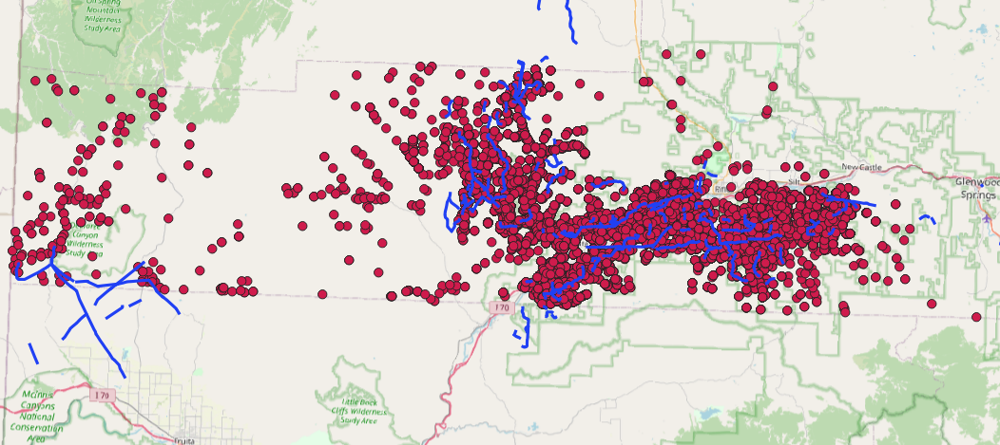

# Pipeline Buffer Analysis (PyQGIS)

## Description
This project demonstrates spatial analysis using PyQGIS, including creation of buffer zones around pipelines and detection of nearby wells.

## What was done
- created 1000m buffer around pipeline geometries
- used spatial index for performance optimization
- checked intersections between wells and buffer zones
- processed large dataset (~16,000 points)

## Tools
- QGIS
- PyQGIS
- Python

## Result

## Data
- Sample dataset included
- Full dataset available upon request
